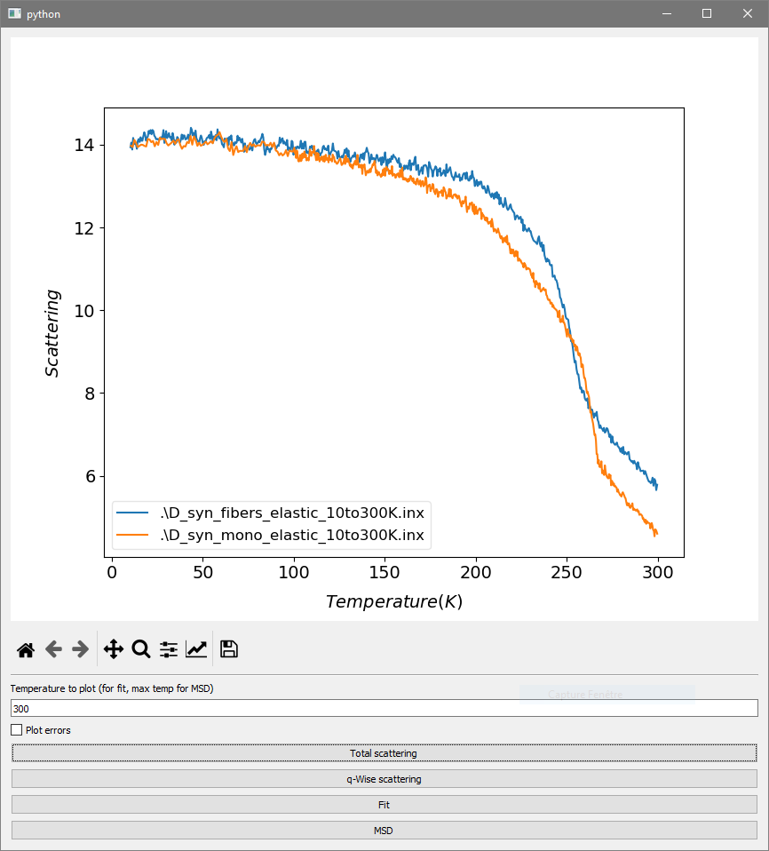
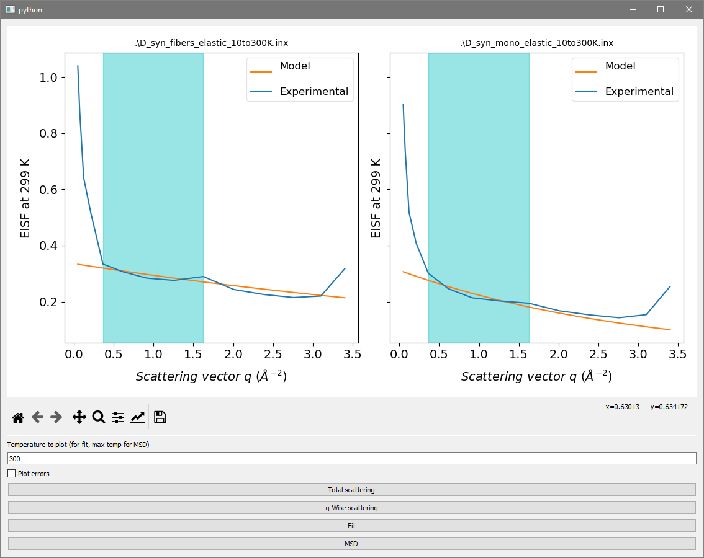
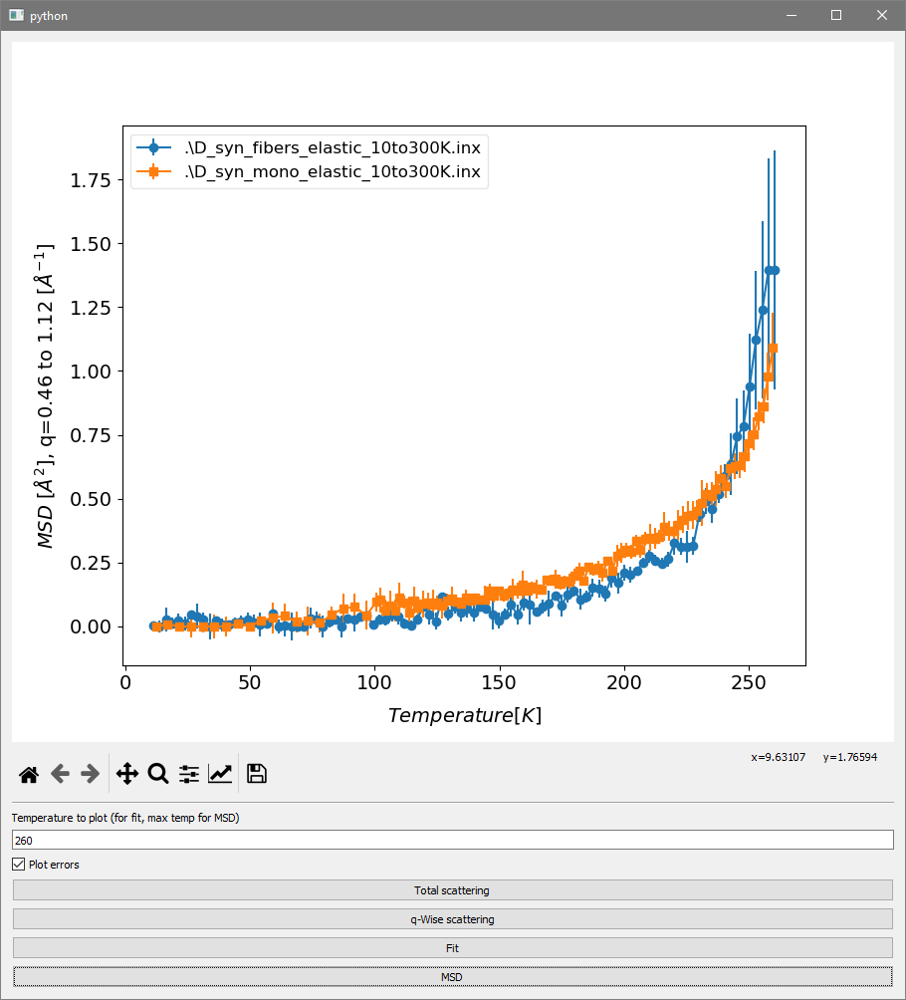
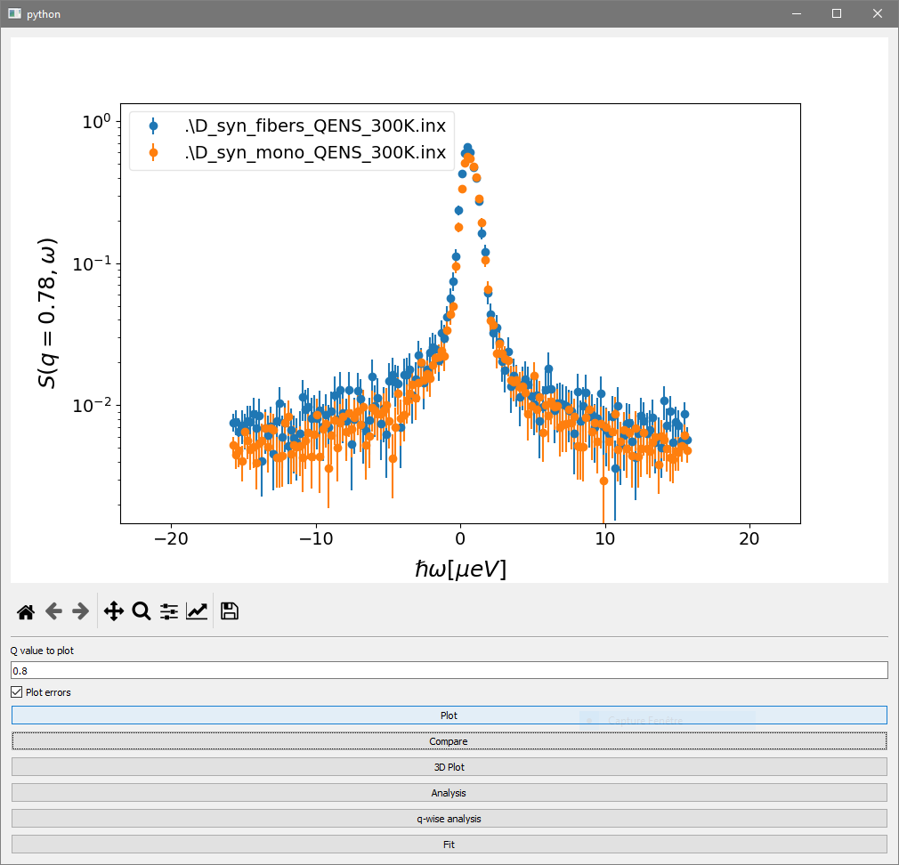
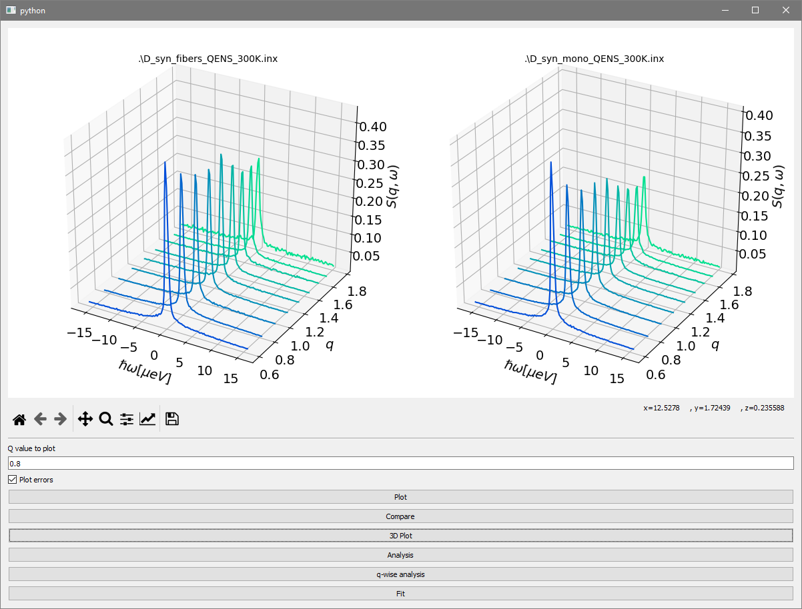
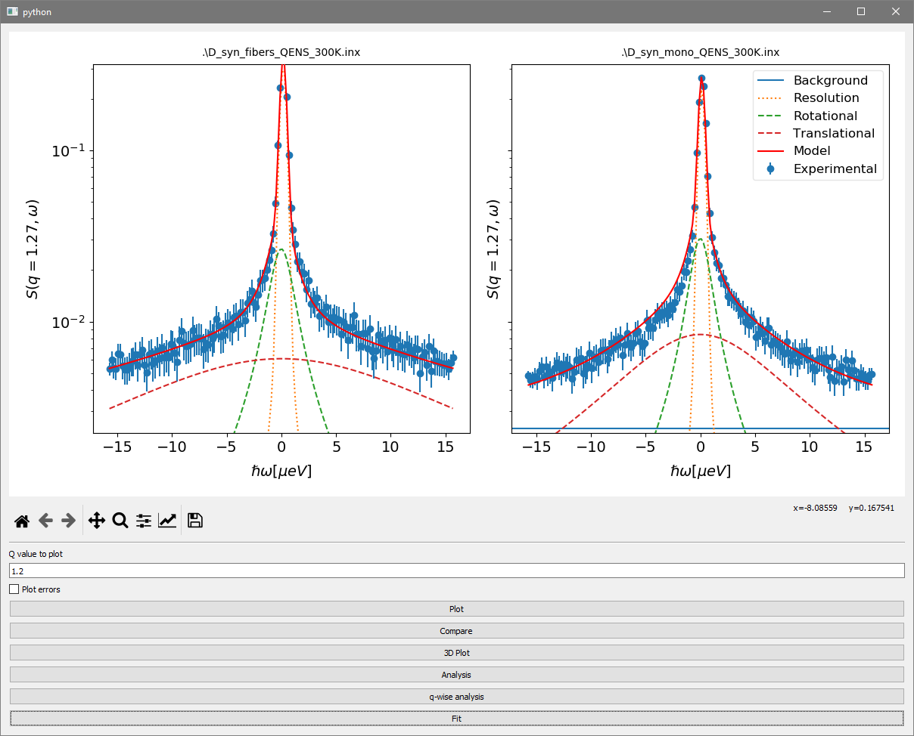
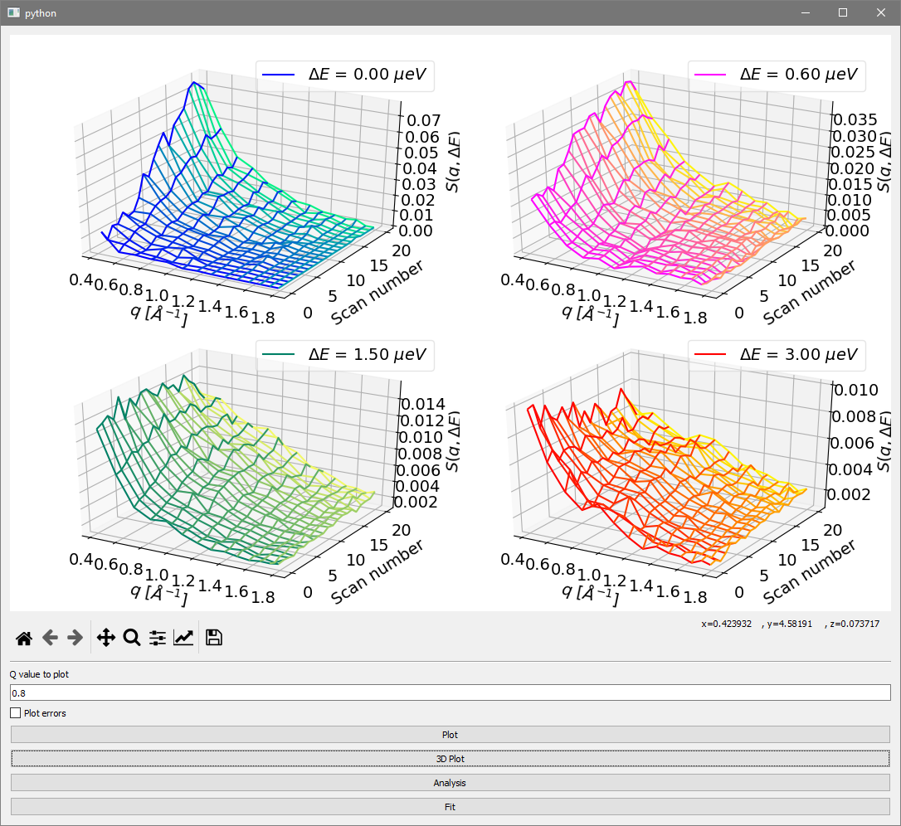
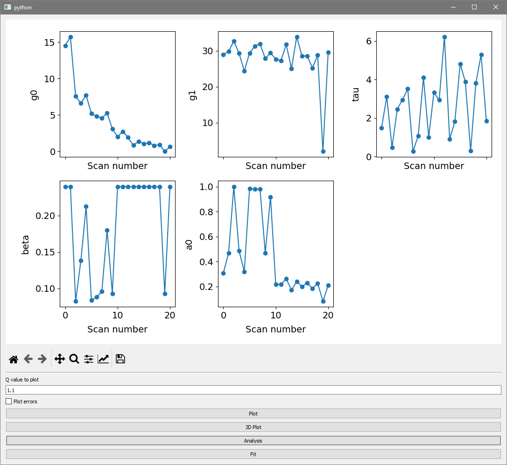

Import data and pre-processing
^^^^^^^^^^^^^^^^^^^^^^^^^^^^^^

For files in hdf5 format, they should be pre-processed using Mantid first - especially for 
unmirroring - as the methods for that are not implemented yet.
The same for data coming from MLZ, .y08 or .inx file format, generated by SLAW software, are used.

.. code-block:: python

    from nPDyn.Dataset import Dataset as npd

    #_Import QENS file with resolution and empty cell measurements
    d = npd( QENSFiles = 'firstFile.inx secondFile.nxs thirdFile.inx'.split(),
             resFiles  = 'firstRes.inx secondRes.nxs thirdRes.inx'.split(),
             ECFile    = 'ecFile.inx' )

    #_Import fixed-window scans files, along with resolution and empty cell (either QENS or fixed-window)
    d = npd( FWSFiles = 'myFile.nxs'.split(),
             [ECFile= or fECFile=] 'ecFile.nxs',
             resFile = 'resFile.nxs' )  

    #_Import temperature ramp elastic measurement
    d = npd( TempRampFiles = 'firstFile.inx secondFile.inx'.split() )

For resolution function, the default behavior is to fit the data using a pseudo-Voigt model, but each 
resolution measurement can be fitted individually using provided or user-provided models.
Then, resolution data can be assigned individually to each dataset (QENS, TempRamp or FWS).
By default, if only one resolution file is given, it is assigned to each experimental dataset,
if the number of resolution files equals the number of experimental dataset, resolution data are 
assigned to each dataset in the same order they were given. If none applies, nothing is done automatically.

Several data treatment can be performed, including binning, normalization, absorption correction or
empty cell substraction.

.. code-block:: python

    from nPDyn.Dataset import Dataset as npd

    #_Files importation

    #_Experimental dataset are located in d.dataSetList, other attributes as resData, ECData or D2OData
    #_allows to directly access the experimental data

    #_To show first dataset attributes
    d.dataSetList[0].data.X
    d.dataSetList[0].data.intensities (detectors row-wise)
    d.dataSetList[0].data.errors (detectors row-wise)
    d.dataSetList[0].data.qVals
    d.dataSetList[0].data.qIdx #_This one gives the indices of q-values that are kept for fitting and plotting

    #_To bin all dataset at once with a bin size of 5
    d.binAll(5)

    #_To bin a subset of loaded datasets
    d.binDataSet(5, 0, 2, 3) #_First argument is bin size, then a list of dataset indices in d.dataSetList

    d.binResData(5) #_For resolution data binning   

    #_To normalize data using resolution function scale factor from provided models
    d.normalize_usingResFunc( [dataset index list, all dataset if None] )

    #_To normalize temperature ramp data using given number of low temperature points (should be first ones)
    d.normalize_ENS_usingLowTemp( [dataset index list, all dataset if None], nbrBins=8)  

    #_To perform absorption corrections, if D2O and res are True, absorption correction are performed on loaded
    #_resolution and D2O data too. canType can be 'tube' or 'slab'.
    #_The method is simply a python wrapper for Joachim Wuttke's C code libabsco: 
    #_see http://apps.jcns.fz-juelich.de/doku/sc/absco
    d.absorptionCorrection(*fileIdxList, canType='tube', canScaling=0.95, 
                                neutron_wavelength=6.27, absco_kwargs={}, D2O=True, res=False)

    #_To perform empty cell substraction, using a scale factor of 0.95 and empty cell data
    d.substract_EC(*fileIdxList, subFactor=0.95, subD2O=True, subRes=False):

    #_To discard specific detectors using their indices in d.dataSetList[i].data.qIdx
    d.discardDetectors( [0, 2, 12, 13], *fileIdxList):

    #_To set the q-range used for fitting and plotting
    d.setQRange(0.2, 1.6, *fileIdxList)

Assign model and fitting
^^^^^^^^^^^^^^^^^^^^^^^^

.. code-block:: python

    #_Importation and pre-processing

    #_To assign a model to datasets, again if *fileIdxList is not given, all datasets are used
    d.assignModeltoData(model, *fileIdxList)

    #_Various models for FWS, QENS or temperature ramp are provided, but user can defined their own
    #_using the same template as the ones in nPDyn.dataTypes.models
    #_Models are stored in the following

    d.models

    #_Where the first word in the name is the type of data it should bu used with, then if its meant for protein 
    #_or water dynamics, then if it is in liquid or powder state, then some properties such as wether there is
    #_one or two Lorentzians, or if the convolution is performed using analytic Voigt profile and finally
    #_the minimization algorithm used. For which, Min is scipy minimize, CF is scipy curve_fit and
    #_BH is scipy basinhopping algorithm.

    #_Then data can be fitted using the following, with p0 allowing to give custom initial parameters,
    #_and bounds allowing to give custom boundaries on parameters.
    #_Argument qWise controls whether the fit is global or q-wise.

    d.fitData(*fileIdxList, p0=None, bounds=None, qWise=False)

Plotting data
^^^^^^^^^^^^^

All dataset can be plotted even within model assigned or fitting having been done. This will just result
is some error messages showing for some plot functions.

.. code-block:: python

    #_Pre-rocessing and fitting

    #_Various methods are provided for plotting, they are listed in the following

    d.plotResFunc() 
    d.plotD2OFunc()
    d.plotECFunc()
    d.plotFWS(fileIdx=0)
    d.plotQENS(*fileIdxList)
    d.plotTempRampENS(*fileIdxList)

Examples of plotting window:
^^^^^^^^^^^^^^^^^^^^^^^^^^^^

